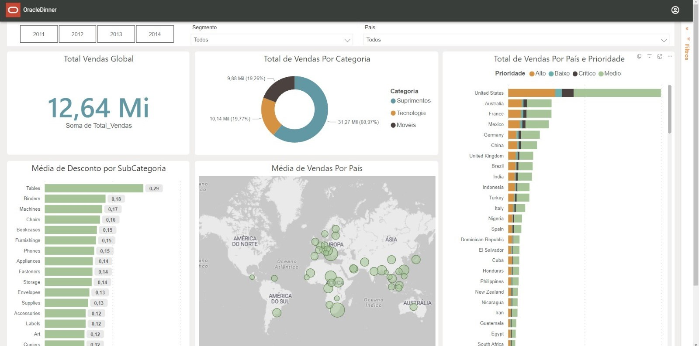
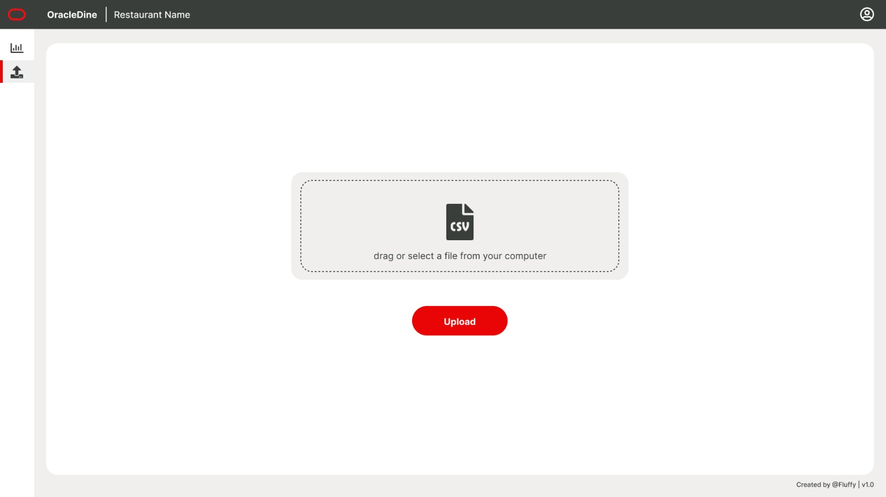
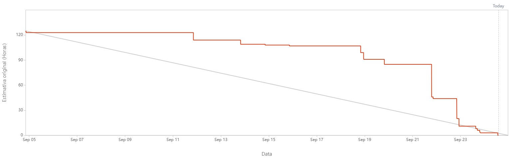

# Projeto-Integrador-Oracle

  

 
      
      
      
      

      <a href="#challenge">About the project</a> •
      <a href="#schedule">Schedule</a> •
      <a href="#team">Team</a> •
      <a href="#utilized-tecnologies">Utilized Tecnologies</a>

## Challenge

In this challenge, you will have the opportunity to create an online platform that will allow restaurant owners to manage their operations in an efficient and intuitive way. The objective is to create a comprehensive system that offers resources such as control panels, graphs, reports and functionalities for managing personnel, suppliers and inputs.

(<a href="#top">Scroll to top</a>)

<li>Functional Requirements</li>
<ul>
      <li>Develop an organizational panel of personnel and suppliers and inputs;</li>
      <li>Develop an employee flow dashboard, people flow, inventory, best selling dishes;</li>
      <li>Develop a comparator of customers x staff x stock, another comparator of predictability of inputs for preparing dishes;</li>
      <li>In the comparator, check the inputs and present what needs to be purchased, in the personnel comparator, consider the flow of customers.</li>
</ul>

<li>Non-Functional Requirements</li>
<ul>
      <li>The website's response time must be below 1000ms in 99.99% of the requests;</li>
      <li>The application's logging mechanism must generate the trails in JSON format (optional);</li>
      <li>The system must contain metrics that help to observe its behavior: Quantity of requests, response time, quantity and percentage of failures when obtaining data from Golden Sources.</li>
</ul>

(<a href="#top">Scroll to top</a>)

## Solution

The Fluffy team will develop a web system that will allow the management of inputs and employees, as well as providing visualization of processed data so that the business owner can manage their sales, stocks, work team and project their future actions.

(<a href="#top">Scroll to top</a>)

## Schedule

| Event                   | Date         |
| ------------------------| -------------|
|Kick-off                 |08/21 to 08/28|
|Sprint 1                 |09/04 to 09/24|
|Sprint 2                 |09/25 to 10/15|
|Sprint 3                 |10/16 to 11/05|
|Sprint 4                 |11/06 to 11/26|
|Feira de Soluções        |12/12         |

(<a href="#top">Scroll to top</a>)

## Backlog

<li>Development of the database regarding the Sales module;</li>
<li>Interface development of the sales screen;</li>
<li>Development of the file upload interface;</li>
<li>Processing of data extracted from .csv;</li>

<li>Development of the supplier management module;</li>
<li>Refinement of data visualization graphs;</li>
<li>Development of reports for decision making;</li>

<li>Development of the employee management module;</li>
<li>Development of graphs relating to employee data;</li>
<li>Create a comparison of customers x employees x stock;</li>
<li>Implement the input predictability comparator;</li>

<li>Login and access levels;</li>
<li>Data enrichment in the data warehouse;</li>
<li>Refinement of BI charts;</li>
<li>Implement application logging mechanism in JSON format (optional).</li>

(<a href="#top">Scroll to top</a>)

## Mockup

### Dashboard Screen

### Upload Data Screen

(<a href="#top">Scroll to top</a>)

## Physical Model (James Martin's Notation)

(<a href="#top">Scroll to top</a>)

## Logical Model (James Martin's Notation)

(<a href="#top">Scroll to top</a>)

## Burndown

(<a href="#top">Scroll to top</a>)

## Data Dictionary

[Click here to accesses the Data Dictionary.](https://github.com/Fluffy-Fatec/Projeto-Integrador-Oracle/blob/development/Documentacao/Dictionary/Data_Dictionary_Sprint_1.pdf)

(<a href="#top">Scroll to top</a>)

## Team

| Avatar            							| Aluno         | Função           		| GitHub                                                      | LinkedIn                                              |
| -------------------------------------------- | ---------------- | ---------------- | -------------------------------------------------------------- | ----------------------------------------------------- |
| |__Michael Felipe__| *Product Owner*|  |  |
| |__Tiago Camillo__| *Scrum Master*|  |  |
| |__Aldrik Álvaro__| *Developer Team*|  |  |
| |__Ana Clara Leal__| *Developer Team* |       |  |
| |__Emanuele Diniz__| *Developer Team*|  |  |
| |__Luiz Felipe Borges__ | *Developer Team* |    |  |
| |__Victor Fernandes__  | *Developer Team*  | |  |

(<a href="#top">Scroll to top</a>)

## Utilized Tecnologies

Front-End

* [vue](https://vuejs.org/)
* [HTML](https://www.w3schools.com/css/)
* [CSS](https://www.w3schools.com/css/)

Back-End

* [Java](https://www.java.com/pt-BR/?msclkid=7faa842eb8f811ecab39772d4c1ae90b)

* [Spring boot](https://spring.io/projects/spring-boot)

Database

* [Oracle Autonomous Database](https://www.oracle.com/autonomous-database/)

Meetings and Communication

* [Discord](https://discord.com/?msclkid=b4f5af84b8f811ecbd81c127a0ae68a7)

* [Whatsapp](https://www.whatsapp.com/)

* [Slack](https://slack.com/intl/pt-br/?msclkid=c00e628eb8f811ecaef374bb86d7f056)

(<a href="#top">Scroll to top</a>)

 

 

---

> GitHub [@fluffyfatec](https://github.com/fluffyfatec) &nbsp;&middot;&nbsp;
> Gmail [fluffyfatec@gmail.com](fluffyapi@gmail)