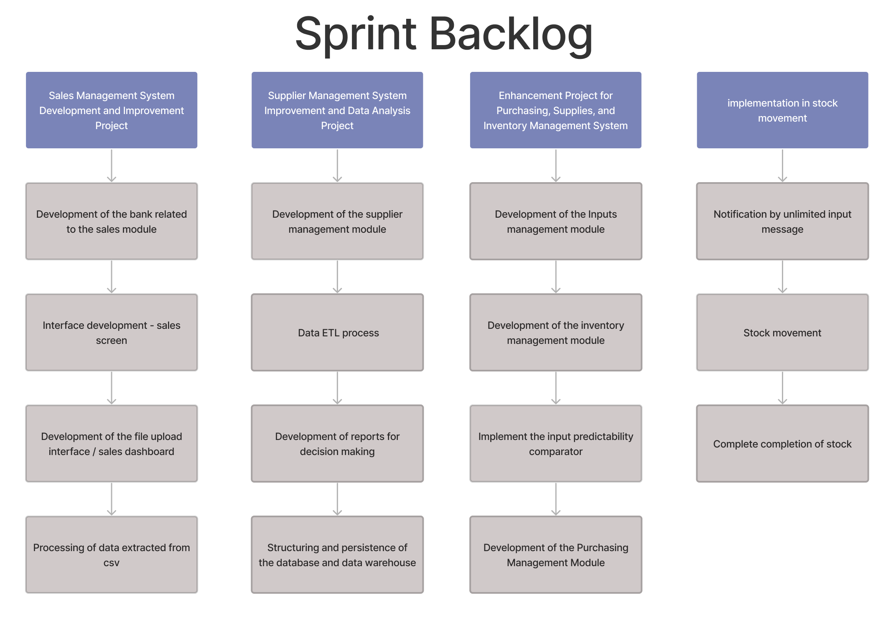
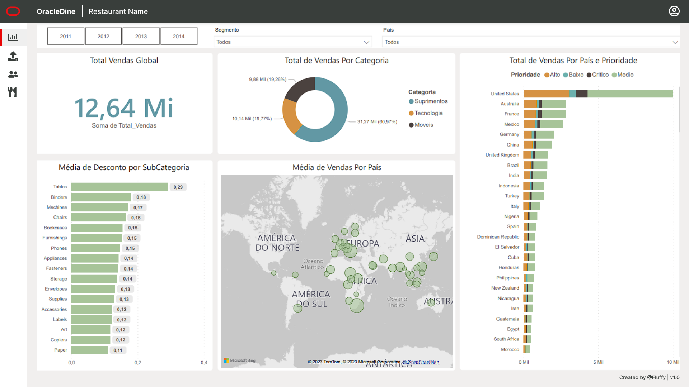
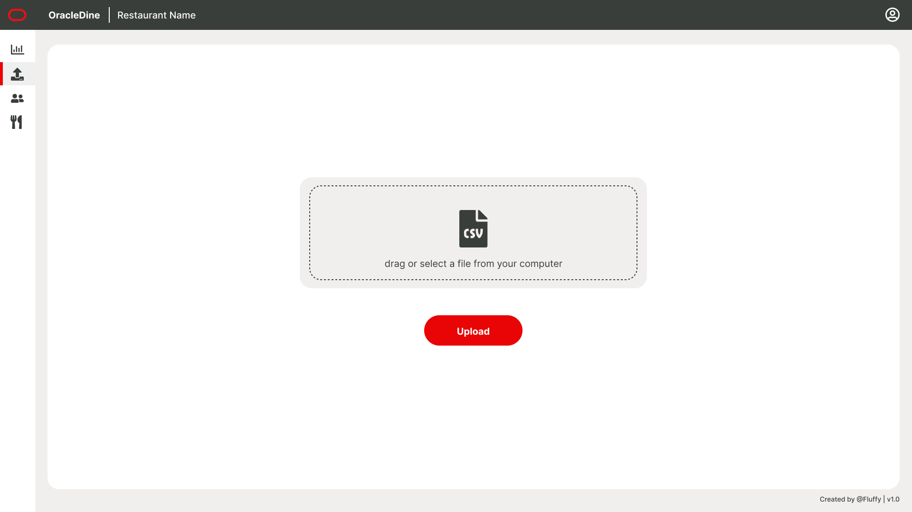
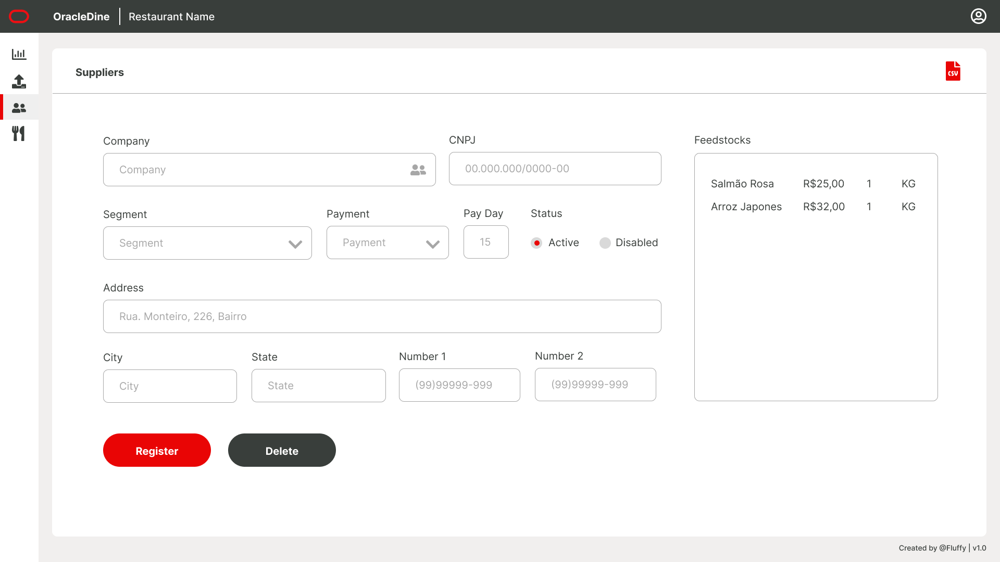
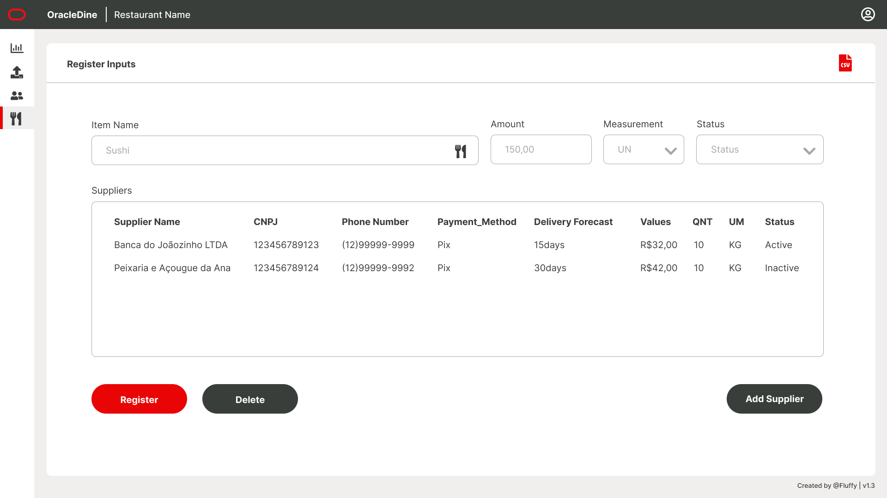
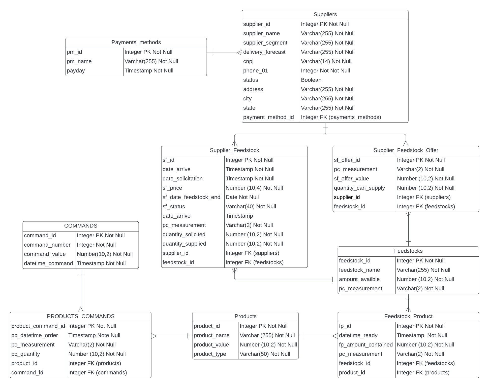
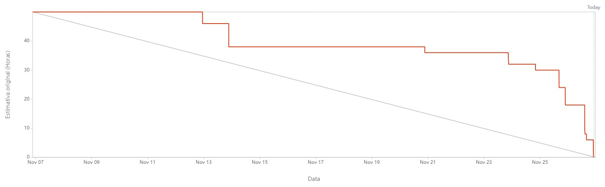

# Projeto-Integrador-Oracle

 

 
      
      
      
      

      <a href="#challenge">About the project</a> •
      <a href="#schedule">Schedule</a> •
      <a href="#team">Team</a> •
      <a href="#utilized-tecnologies">Utilized Tecnologies</a>

## Challenge

In this challenge, you will have the opportunity to create an online platform that will allow restaurant owners to manage their operations in an efficient and intuitive way. The objective is to create a comprehensive system that offers resources such as control panels, graphs, reports and functionalities for managing personnel, suppliers and inputs.

(<a href="#top">Scroll to top</a>)

<li>Functional Requirements</li>
<ul>
      <li>Develop an organizational panel of personnel and suppliers and inputs;</li>
      <li>Develop an employee flow dashboard, people flow, inventory, best selling dishes;</li>
      <li>Develop a comparator of customers x staff x stock, another comparator of predictability of inputs for preparing dishes;</li>
      <li>In the comparator, check the inputs and present what needs to be purchased, in the personnel comparator, consider the flow of customers.</li>
</ul>

<li>Non-Functional Requirements</li>
<ul>
      <li>The website's response time must be below 1000ms in 99.99% of the requests;</li>
      <li>The application's logging mechanism must generate the trails in JSON format (optional);</li>
      <li>The system must contain metrics that help to observe its behavior: Quantity of requests, response time, quantity and percentage of failures when obtaining data from Golden Sources.</li>
</ul>

(<a href="#top">Scroll to top</a>)

## Solution

The Fluffy team will develop a web system that will allow the management of inputs and employees, as well as providing visualization of processed data so that the business owner can manage their sales, stocks, work team and project their future actions.

Aiming to solve the project, the system will be delivered in four sprints:

| Sprint                  | Need      | Product         |
| ------------------------| -------------|-------------|
|Sprint 1                 | Visualization of the establishment's Sales data | System developed with functionalities for inserting data related to sales via .csv files and viewing them through various graphs and dynamic filters. |
|Sprint 2                 | Visualization and management of the establishment's Suppliers data, visualization of reports for future decision making. | System developed with functionalities for inserting data related to suppliers and viewing them through various graphs and dynamic filters. The payment part and reports for data comparisons were also developed. |
|Sprint 3                 | Visualization and management of the establishment's Inputs and Stock data, visualization of comparators for predictability. | System developed with functionalities for inserting data related to inputs and stock, as well as viewing them through various graphs and dynamic filters. It was also implemented the input predictability comparator. |
|Sprint 4                 | Complete movement of data related to inputs and stock, receipt of notifications regarding low quantity of products in stock. | System developed with complete functionalities regarding data related to inputs and stock, as well as receiving notifications regarding low quantity of a product in stock. |

(<a href="#top">Scroll to top</a>)

## Schedule

| Event                   | Date         |
| ------------------------| -------------|
|Kick-off                 |08/21 to 08/28|
|Sprint 1                 |09/04 to 09/24|
|Sprint 2                 |09/25 to 10/15|
|Sprint 3                 |10/16 to 11/05|
|Sprint 4                 |11/06 to 11/26|
|Feira de Soluções        |12/12         |

(<a href="#top">Scroll to top</a>)

## Product Backlog

| Rank           | Priority    | User Story         | Estimate | Sprint |
| ---------------| ----------------| -------------------| -----------| -------|
| 1 | High | As a system administrator, I want to have access to a real-time control panel to monitor system performance and quickly identify potential issues. | 1 | 1 |
| 2 | High | As a company manager, I wish for an executive dashboard summarizing key system activities to facilitate analysis and monitoring. | 1 | 1 |
| 3 | High | As a company manager, I want the ability to view sales performance for a specific period for analysis and decision-making. | 1 | 1 |
| 4 | Medium | As the head of the finance department, I want an automated billing system and transaction processing to streamline the process and ensure accuracy. | 1 | 1 |
| 5 | Medium | As a business-interested user, I want access to analyses and trends on customer preferences to identify business opportunities. | 3 | 1 |
| 6 | High | As a company manager, I want customized reports on essential metrics to make strategic decisions based on data. | 2 | 2 |
| 7 | High | As a system administrator, I want the ability to add and manage planned vendor information to facilitate communication and agreements. | 3 | 2 |
| 8 | Medium | As a member of the finance department, I desire detailed reports for in-depth analysis of the company's finances. | 2 | 2 |
| 9 | Medium | As a company manager, I want reports on the stock delivery history to better meet demands and avoid shortages or excess of products. | 4 | 3 |
| 10 | Medium | As a company employee, I want an alert system to inform about items with low stock to expedite orders to suppliers. | 3 | 3|
| 11 | Medium | As a business user, I want a quick summary of current promotions and their impact on sales to identify business strategies. | 2 | 3 |
| 12 | High | As a system administrator, I want enhanced security features to protect sales and transaction-related information. | 4 | 4 |

(<a href="#top">Scroll to top</a>)

## Sprint Backlog

(<a href="#top">Scroll to top</a>)

## Mockup

### Dashboard Screen

### Upload Sales Data Screen

### Suppliers Screen

### Stock Screen

(<a href="#top">Scroll to top</a>)

## DER Database

### Logical Model (James Martin's Notation)

<!--### Data Warehouse

#### Star Model

(<a href="#top">Scroll to top</a>)
-->

## Burndown

(<a href="#top">Scroll to top</a>)

## Data Dictionary

[Click here to accesses the Data Dictionary of the Database.](https://github.com/Fluffy-Fatec/Projeto-Integrador-Oracle/blob/develop/Documentacao/Dictionary/Database_Data_Dictionary_Sprint_4.pdf)

(<a href="#top">Scroll to top</a>)

## DevOps Documentation

[Click here to accesses the DevOps Documentation.](https://fluffyfatec.atlassian.net/l/cp/RDTC3CTw)

(<a href="#top">Scroll to top</a>)

## Team

| Avatar            							| Student         | Function           		| GitHub                                                      | LinkedIn                                              |
| -------------------------------------------- | ---------------- | ---------------- | -------------------------------------------------------------- | ----------------------------------------------------- |
| |__Michael Felipe__| *Product Owner*|  |  |
| |__Tiago Camillo__| *Scrum Master*|  |  |
| |__Aldrik Álvaro__| *Developer Team*|  |  |
| |__Ana Clara Leal__| *Developer Team* |       |  |
| |__Emanuele Diniz__| *Developer Team*|  |  |
| |__Luiz Felipe Borges__ | *Developer Team* |    |  |
| |__Victor Fernandes__  | *Developer Team*  | |  |

(<a href="#top">Scroll to top</a>)

## Utilized Tecnologies

Front-End

* [vue](https://vuejs.org/)
* [HTML](https://www.w3schools.com/css/)
* [CSS](https://www.w3schools.com/css/)

Back-End

* [Java](https://www.java.com/pt-BR/?msclkid=7faa842eb8f811ecab39772d4c1ae90b)

* [Spring boot](https://spring.io/projects/spring-boot)

Database

* [Oracle Autonomous Database](https://www.oracle.com/autonomous-database/)

Meetings and Communication

* [Discord](https://discord.com/?msclkid=b4f5af84b8f811ecbd81c127a0ae68a7)

* [Whatsapp](https://www.whatsapp.com/)

* [Slack](https://slack.com/intl/pt-br/?msclkid=c00e628eb8f811ecaef374bb86d7f056)

(<a href="#top">Scroll to top</a>)

 

 

---

> GitHub [@fluffyfatec](https://github.com/fluffyfatec) &nbsp;&middot;&nbsp;
> Gmail [fluffyfatec@gmail.com](fluffyapi@gmail)
